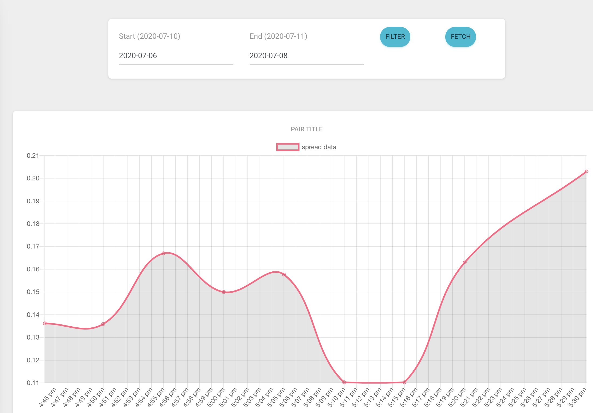

# python-flask-market-exchange-data 

Python web Flask app in Docker which calculate bid-ask spread value base on market Crypto exchange. 

### Build application
Build the Docker image manually by cloning the Git repo.
```
$ docker build -t docker_exchange_analysis:latest .
```
### Run the container

Create a container from the image.
```
$ docker run -it -d -p 5000:5000 docker_exchange_analysis:latest
```

Now visit http://localhost:5000 

### Run by cmd
```
$ pip3 install -r requirement.txt
$ python app.py 
$ celery worker -l info -A workers.celery 
$ celery beat -l info -A workers.celery
```

### Install mongodb
https://www.mongodb.com/try/download/community

### Runing test case 
```
$ export PYTHONPATH=.
$ pytest --setup-show tests/func/ -v
```

### Populate database

Init default key pairs exchange.
```
$ GET http://localhost:5000/api/populate
```




